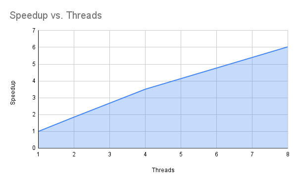
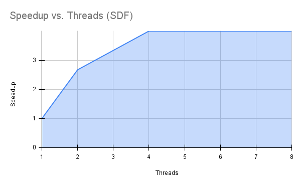

1. Create a graph plotting number of threads along the X-axis and speedup along the Y-axis. Include the image in your README.

2. For the speedup graph, describe the shape of the curve. Does it converge to some general value?

the shape of the curve is positive exponential , it starts to flatten from 4 to 8 cores but rises significantly for all threads.  from what is see, it will flatten out around 6x to 8x.

3. What is the maximum speedup you achieved from threading?

6x is the maximum speedup that we can observe on 8 threads

4. What happens when you use more cores than are available in the hardware?

speeds will eventually flatten out and will not speedup anymore.

5. Considering the number of cores in the system, do you get linear scaling of performance as you add more cores?

the program will not scale linearly. we did get linear speedup from 1 to 4  by 3.51 but will start to fall of like from 4 to 8 at 6.03.

6. According to Amdahl’s Law, the runtime is: T = (1 − p)T + (p / n)T. What value would you propose for p based on your graph, and how did you determine it?

using my 8 thread results, if you solve for p, you get 0.953. which means that 95% of computations can run parallel.
 
7. For the mean computation kernel:

How many bytes of data are required per iteration?

4 bytes per each iteration, because each sample is a float.

What is the bandwidth used by the kernel?

for 1 thread you get 2.64 gb/s, because 34GB / 12.91, for 2 threads 4.88 gb/s, for 4 threads 9.24 gb/s, and for 8 threads 15.89 gb/s

Is the bandwidth consistent across threaded versions?

the bandwidth increased but eventually flattens out.

8. After completing sdf.cpp and updating trials.sh, collect runtimes for sdf.out using different thread counts.
Create a graph of these speedups.

9. Do you get a similar performance curve for sdf.out compared to threaded.out?

yes loosely, they both are positively exponential, rising fast then falling off. but the sdf graph stops at 4x speedup.

10. What volume value did your Monte Carlo calculation produce?
How does it compare to the analytic value (0.4764012244)?
for 1 thread 0.475934, 2 threads 0.476257, 4 threads 0.476540, and for 8 threads 0.476712, compared to the analytic value, its only off by around 0.0003 which is expected.

11. Describe how increasing the number of sample points (-n option) affects accuracy.

 increasing the number of sample points increased the accuracy of the monte carlo estimate because the monte carlo intergration uses random sampling, therefore more samples = greater accuracy.

12. Explain why the parallel speedup behaves the way it does for the Monte Carlo computation.

 the more threads you throw at the monte carlo computation, the less each thread has to work, and the overhead eventually becomes the limiter.

